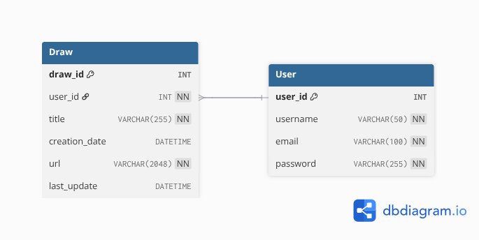

<header style="display: flex;align-items: center;width:50%;">
    

        <h1>DRAWEB</h1>
    

    
</header>

## Table of Contents
- [Introduction](#introduction)
- [Usage](#usage)
- [Requirements](#requirements)
- [Design](#design)
    - [Database Design](#database-design)
    - [Architecture](#architecture)
- [Implementation](#implementation)
    - [Frontend](#frontend)
    - [Backend](#backend)
- [Testing](#testing)

## Introduction
Draweb is a web application for vector drawing built without CSS Frameworks, JavaScript Libraries or any other Frontend Framework.

## Usage
1. Run the SQL script [draweb-db.sql](/draweb-db.sql) to create the database and tables.
2. Create a database account and add privileges to the database.

## Requirements
The main purpose of this project is to create a web application for vector drawing without CSS Frameworks, JavaScript Libraries or any Frontend Framework.
The following list shows the desired functionalities of the application:
1. Create account
2. Login
3. Create drawings
4. Save drawing to database
5. Load user's drawings from database
6. Delete saved drawing

The core functionality of the application is the drawing feature, which includes:
- Creation of vector shapes (squares, rectangles, circles, lines and different polygons)
- Changing shape properties (color, border color, border thickness)
- Uploading images to the canvas
- Moving, resizing and deleting shapes
- Managing layers (bring to front, send to back)

After analysing the requirements, we can see that the application strength lies in its drawing capabilities. The backend services are minimal, therefore the backend technology needs to be robust (due to its web-based nature) and a tool that enhances development time speed.

## Design

### Database Design
The entities identified which need to be persisted in the database are:
- **User**: represents a user of the application, with the capability to create and manage drawings.
- **Drawing**: represents a drawing created by a user, which can be saved and loaded again in the application.

Since the application database script is built with SQL, I could choose any relational database management system that supports SQL. 
For this reason, I decided to add an abstraction layer with interfaces, that allows to connect to different database systems without changing the code of high-level layers.

### API Design
| Endpoint | Method | Description | Request Body | Response body |
|----------|--------|-------------| -------------|---------------|
| /draweb-api/users               | POST | Create a new user account | User (username, email, password) | User (id, username, email, password) |
| /draweb-api/authenticate        | POST | Authenticate a user and return a token | User (username, password) | Token |
| /draweb-api/users/{id}/drawings | POST | Save a new drawing | Drawing (title, svg) | Nothing |
| /draweb-api/users/drawings/{id} | GET  | Retrieve a specific drawing by its ID |  | Svg |
| /draweb-api/users/{id}/drawings | GET  | Retrieve all drawings of a user | Nothing | List of Drawing (drawingId, userId, title, creationDate, lastUpdate, url) |
| /draweb-api/users/drawings/{id} | DELETE | Delete a specific drawing by its ID  | Nothing | Nothing |
| /draweb-api/users/drawings/{id} | PATCH | Update a specific drawing by its ID |  |  |

### Architecture
The architecture of the aplication is based on a client-server model, due its simplicity and web nature. 

- **Client:** The client needs to be composed only by HTML, CSS and JavaScript files, in order to satisfy the constraint of not using any Front-end Framework. Therefore, the deployment of the client needs a web server like Apache or IIS to serve the static files.
- **Server:** The backend service could be built using any tech stack, since there is no a specific constraint. I decided to use the Repository Pattern to separate the data access logic and endponints handlers logic. This allows to change the "source of truth" (database) without affecting the high-level layers.

## Implementation

### Client
One of the most important decisions here is the way to implement the drawing feature, since there are two options: using SVG or Canvas API. The following table shows the comparison that I made to decide:

| SVG | Canvas API |
|-----|------------|
| Each shape is a DOM element, allowing to manipulate them individually. | The canvas is a bitmap, so individual shapes manipulations is more complex. |
| It is more complex to implement the pencil tool, but it is not a requirement for this project. | The pencil tool is easy to implement, but it is not a requirement for this project. |
| Save a draw is achieved by saving XML generated, allowing to load it later and continue editing. | Save a draw is difficult, because you need to save the drawing commands, making more difficult to load and continue editing. |

Final decision: **SVG**, since the main requirement is to create shapes and manipulate them individually.

### Server
The backend is composed by two main projects:
- **Service**: contains the logic and handlers for every API endpoint.
- **Data**: is a class library with the necessary code to connect to the database and manipulate data in the database.

### Security practices
The following security practices were implemented:
1. Token-based authentication.
2. Input validation in client and server side.

## Testing
In the [Test Project](/service/DrawebTest/) you can find the tests of the Data Layer. 

# Pending improvements
- [ ] Implement Tests for service layer
- [ ] Hash passwords before storing them in the database
- [ ] Store JWT in a cookie
- [ ] Implement refresh tokens for JWT
- [ ] Implement error handling middleware in the backend
- [ ] Script deployment