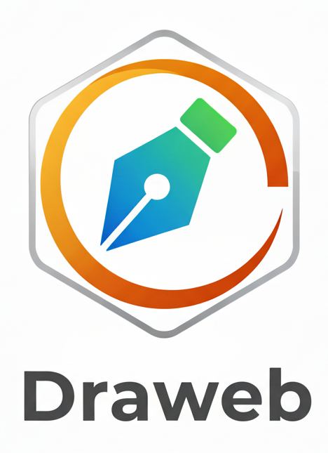

<header style="display: flex;align-items: center;width:50%;">
    

        <h1>DRAWEB</h1>
        
Draweb is a web application for vector drawing built without CSS Frameworks, JavaScript Libraries or any other Frontend Framework.

    

    
</header>

## Usage
1. Run the SQL script `draweb.sql` to create the database and tables.
2. Create a database account and add privileges to the database.

## Development Process
In this sections you can find information about the development process of Draweb, including design decisions, architecture, and implementation details.

### Requirements
The main purpose of this project is to create a web application for vector drawing without CSS Frameworks, JavaScript Libraries or any Frontend Framework.
The following list shows the desired functionalities of the application:
1. Create account
2. Login
3. Create drawings
4. Save drawing to database
5. Load user's drawings from database

The core functionality of the application is the drawing feature, which includes:
- Creation of vector shapes (squares, rectangles, circles, lines and different polygons)
- Changing shape properties (color, border color, border thickness)
- Uploading images to the canvas
- Moving, resizing and deleting shapes
- Managing layers (bring to front, send to back)

After analysing the requirements, we can see that the application strength lies in its drawing capabilities. The backend services are minimal, therefore the backend technology needs to be robust (due to its web-based nature) and a tool that enhances development time speed.

### Design
The entities identified which need to be persisted in the database are:
- User: represents a user of the application, with the capability to create and manage drawings.
- Drawing: represents a drawing created by a user, which can be saved and loaded again in the application.

### Implementation

### Testing

### Deployment